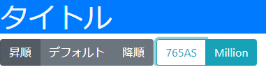
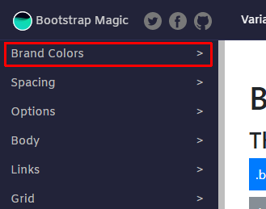
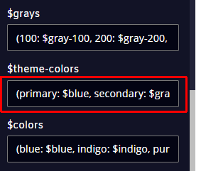
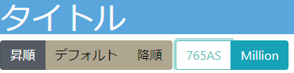
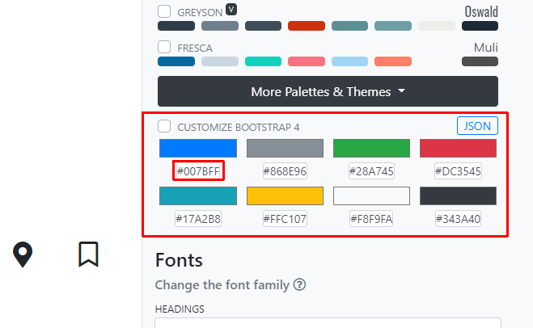
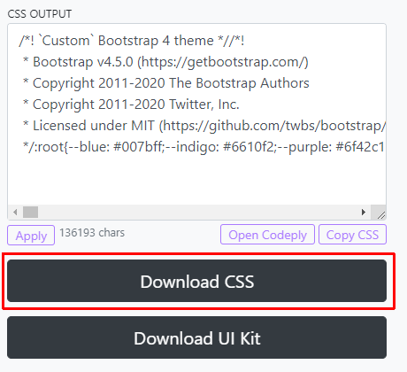
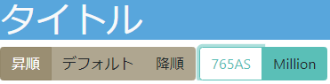

# Bootstrapのテーマカラーカスタマイズ

## 背景
BootstrapはWebページのデザインを構築するのにとても便利です。デザインセンスがなくても、デフォルトのパーツを使えばなんとなくいい感じのデザインにしてくれます。

とはいえ、デフォルトで使い続けるのも飽きが来ます。ビビッドな配色はいかにもな感じですしね(視覚障碍者に配慮してコントラストを高くしているようですが)。

(例：それぞれ、bg-primary, btn-secondary, btn-outline-infoに設定)

ということで、色をカスタマイズしてみます。

## 変更方法
設定方法はぴー助さんのページ[1]に詳しいのでそちらをご覧ください。
1. ツールを使ってCSSを作成する。
1. HTMLファイルの`<header>`タグのなかで、BootstrapのCSSを読み込んでいる箇所のすぐ下で、上で作成したCSSを読み込む。
    * ちなみに私はgithub pagesでHTMLファイルを公開しているので、`<link rel="stylesheet" href="https://tankarup.github.io/million.css">` なふうに読み込んでいます。 

ただ、ぴー助さんのページで紹介されているツール[Bootstrap 4 Color Utility Generator](https://lingtalfi.com/bootstrap4-color-generator#)を試してみたところ、条件によっては正しいカラーHEX値を返してくれませんでした。

そこで別のツールを調査しました。

## [Bootstrap Magic](https://pikock.github.io/bootstrap-magic/app/index.html#!/editor)
[Bootstrap Magic](https://pikock.github.io/bootstrap-magic/app/index.html#!/editor)の使い方を説明します。

まず、画面左上の`Brand Colors`を開きます。

下のほうに移動して、`$theme-colors`の中身を編集します。`primary: $blue`となっている箇所を例えば`primary: #ff0000`に変更すると`primary`で設定した箇所が真っ赤になります。ほかのテーマ色も好きに変えましょう。

最後に、右上の`Save`ボタンを押して、`Save CSS`でCSSファイルがダウンロードされます。

この方法で作ったCSSファイルを使うとこんな感じの見た目に変わります。

(ラジオボタンの配色設定をミスっているような…？)

## [Themestr.app](https://themestr.app/theme)
Themestr.app](https://themestr.app/theme)の使い方を説明します。

画面右側にある`Customize Bootstrap 4`のところにあるカラーコードHEX値を編集し、`Customize Bootstrap 4`のチェックマークを入れます。

下のほうに移動して、`Download CSS`ボタンを押すとCSSファイルがダウンロードできます。

この方法で作ったCSSファイルを使うとこんな感じの見た目に変わります。

## まとめ
ツールを二つ紹介しましたが、細かいところではそれぞれで違いがあるようです。また今回紹介した基本配色の設定以外にも様々な設定が可能です。色々ためしてみてください。

[1] ぴー助, Bootstrapで *-primary の色を一括変更するには, https://pisuke-code.com/bootstrap-change-primary-color/